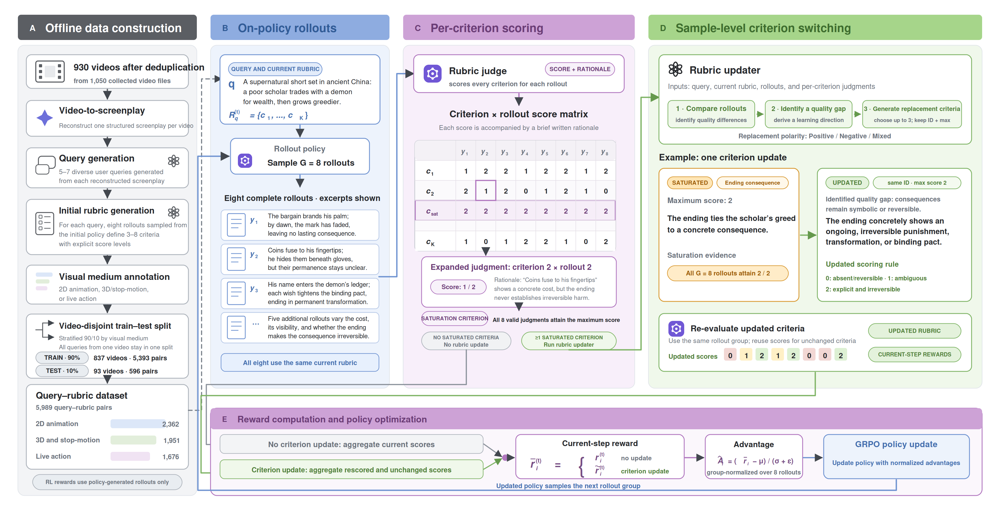
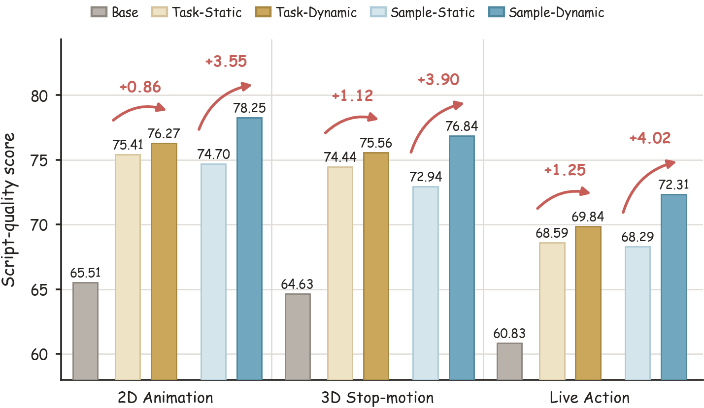

<div align="center">

# RARE: Reinforcement Learning with Adaptive Rubric Evolution for Open-Ended Generation

Official implementation and data release for the RARE ICLR 2027 submission.

<p>
  <a href="https://openreview.net/forum?id=XgYh8jfypi"></a>
  <a href="https://eureka-maggie.github.io/RARE/"></a>
  <a href="https://huggingface.co/datasets/EurekaTian/RARE"></a>
  <a href="https://github.com/Eureka-Maggie/RARE/actions/workflows/ci.yml"></a>
  <a href="LICENSE"></a>
</p>

</div>

**[Project page & interactive examples](https://eureka-maggie.github.io/RARE/)** ·
[Paper](https://openreview.net/forum?id=XgYh8jfypi) ·
[Dataset](https://huggingface.co/datasets/EurekaTian/RARE)

RARE trains language models for complete screenplay generation with rubric
rewards that evolve alongside the policy. It supports task-level rubric
rewriting and sample-level criterion switching in **Negative**, **Positive**,
and **Mixed** directions, together with matched static-rubric baselines.

<p align="center">
  
</p>

## Highlights

- **Criterion-level adaptation.** Saturated criteria are detected from an
  eight-rollout on-policy group and replaced in place while the remaining
  reward dimensions stay fixed.
- **Two evolution scopes.** Sample-level rubrics evolve independently for
  each query; task-level rubrics evolve from evidence aggregated across
  recent query groups.
- **Controlled replacement directions.** The released recipe reproduces
  Negative, Positive, and Mixed sample-level variants with a shared training
  entry point.
- **Open training data.** The accompanying
  [Hugging Face dataset](https://huggingface.co/datasets/EurekaTian/RARE)
  contains 5,989 sanitized query-rubric pairs across 930 source-video groups.
- **Built on verl.** The repository includes the exact reward managers,
  prompts, launchers, and required `verl` training snapshot used by the
  released experiments.

## Results

Dynamic rubrics improve their matched static baselines across 2D animation,
3D/stop-motion, and live-action script generation. The main sample-level
setting uses Negative replacement.

<p align="center">
  
</p>

Independent pairwise evaluation also favors dynamic training across all three
production styles; see [the pairwise results](assets/pairwise_evaluation.png)
and [implementation notes](docs/paper_implementation_notes.md).

## Released variants

| Scope | Variant | Launcher |
| --- | --- | --- |
| Sample | Static rubric | `scripts/train_sample_static.sh` |
| Sample | Dynamic, Negative | `scripts/train_sample_dynamic_negative.sh` |
| Sample | Dynamic, Positive | `scripts/train_sample_dynamic_positive.sh` |
| Sample | Dynamic, Mixed | `scripts/train_sample_dynamic_mix.sh` |
| Task | Static rubric | `scripts/train_task_static.sh` |
| Task | Scheduled dynamic rubric | `scripts/train_task_dynamic.sh` |

All launchers call the validated entry point in `scripts/train.py`. The
default task is `3d_stopmotion`; `2d_animation` and `live_action` are also
available through `--task`.

## Installation

Python 3.12 and [`uv`](https://docs.astral.sh/uv/) are recommended.

```bash
git clone https://github.com/Eureka-Maggie/RARE.git
cd RARE

curl -LsSf https://astral.sh/uv/install.sh | sh
uv venv --python 3.12
source .venv/bin/activate
uv pip install -e '.[vllm,test]'
```

PyTorch, vLLM, FlashAttention, and FlashInfer builds must match the CUDA
driver on the target machine. Install cluster-compatible builds before
starting a full training run.

## Dataset

Download the exact training and test files from Hugging Face:

```bash
python scripts/download_data.py
```

The downloader restores the layout expected by the launchers:

```text
data/scripts/video_corpus_manual_v1_1b_20260807/
├── 2d_animation/{train,test}.parquet
├── 3d_stopmotion/{train,test}.parquet
└── live_action/{train,test}.parquet
```

The data release contains annotations only. Source-video titles and uploader
handles are replaced with stable anonymous IDs, and original videos are not
redistributed. See [data/README.md](data/README.md) and the
[dataset card](https://huggingface.co/datasets/EurekaTian/RARE) for the schema,
provenance, limitations, and CC BY 4.0 terms.

The dataset can also be loaded directly:

```python
from datasets import load_dataset

dataset = load_dataset("EurekaTian/RARE", "2d_animation")
```

## Model and API configuration

Download `Qwen3-4B-Instruct-2507` or provide a compatible local checkpoint.
The path must contain `config.json`.

```bash
export MODEL_PATH=/path/to/Qwen3-4B-Instruct-2507
```

The reward judge, validation judge, and rubric writer use the OpenAI Responses
API. Keep credentials in the environment or a secret manager:

```bash
export OPENAI_API_KEY="your_api_key_here"
export OPENAI_MODEL="your-model"
```

The three roles may be configured independently:

```bash
export RUBRIC_SCRIPT_JUDGE_MODEL="your-judge-model"
export RUBRIC_SCRIPT_SWITCH_MODEL="your-writer-model"
export RUBRIC_SCRIPT_VAL_JUDGE_MODEL="your-validation-model"
```

For an OpenAI-compatible deployment, set `OPENAI_BASE_URL`. Set
`OPENAI_OMIT_TEMPERATURE=1` when the selected model does not accept a
temperature parameter.

## Training

Run any released variant directly:

```bash
bash scripts/train_sample_static.sh --task 3d_stopmotion
bash scripts/train_sample_dynamic_negative.sh --task 3d_stopmotion
bash scripts/train_sample_dynamic_positive.sh --task 3d_stopmotion
bash scripts/train_sample_dynamic_mix.sh --task 3d_stopmotion
bash scripts/train_task_static.sh --task 3d_stopmotion
bash scripts/train_task_dynamic.sh --task 3d_stopmotion
```

Useful overrides:

```bash
bash scripts/train_sample_dynamic_mix.sh \
  --task 2d_animation \
  --model-path "$MODEL_PATH" \
  --output-dir ./checkpoints \
  --gpus-per-node 8 \
  --epochs 2
```

Inspect the exact Hydra command without starting Ray, loading the model, or
calling an API:

```bash
bash scripts/train_task_dynamic.sh --model-path "$MODEL_PATH" --dry-run
```

By default, metrics are written to the console and checkpoints are stored
under `./checkpoints`. No experiment-tracking credential is embedded in the
repository.

## Method behavior

- **Sample-Static** uses the query-specific rubric stored with each example.
- **Sample-Dynamic** detects saturated criteria over an eight-rollout group,
  replaces up to three criteria in the selected direction, rescores only the
  replacements, and commits schema-valid updates atomically.
- **Task-Static** shares one fixed six-criterion rubric within each production
  style.
- **Task-Dynamic** rewrites the shared task rubric at the released schedule
  using evidence from recent rollout groups.
- Failed judge calls receive placeholder reward and are masked out of GRPO
  group comparisons through `judge_valid`.
- The released pipeline is single-turn; tool-agent and search reproductions
  are intentionally outside this release.

## Verification

Lightweight checks require neither GPUs nor API calls:

```bash
ruff check scripts rubric/openai_client.py \
  verl/experimental/reward_loop/reward_manager/rubric_scripts.py \
  verl/experimental/reward_loop/reward_manager/rubric_scripts_task.py
python -m pytest -q tests
```

Full training additionally requires the local model checkpoint, eight suitable
GPUs for the released default configuration, and access to the configured API
models.

## Repository structure

```text
assets/                         README figures
data/                           dataset documentation; files downloaded separately
docs/                           project page, selected examples, and implementation notes
rubric/                         judge, writer, and task-level rubric assets
scripts/                        dataset utilities and six training launchers
tests/                          data, launcher, client, and reward-manager tests
verl/                           required training-framework snapshot
```

## Paper

**RARE: Reinforcement Learning with Adaptive Rubric Evolution for Open-Ended Generation.**
ICLR 2027 submission.

[Read the paper on OpenReview](https://openreview.net/forum?id=XgYh8jfypi) or
[explore the project page](https://eureka-maggie.github.io/RARE/).

## License and acknowledgements

Code is released under the [Apache License 2.0](LICENSE). Dataset annotations
are released separately under CC BY 4.0; see [DATA_LICENSE.md](DATA_LICENSE.md).

RARE is built on [`verl`](https://github.com/verl-project/verl). Upstream
copyright and license notices are retained, and imported-code provenance is
documented in [THIRD_PARTY_NOTICES.md](THIRD_PARTY_NOTICES.md).

Contributions are welcome; see [CONTRIBUTING.md](CONTRIBUTING.md).
